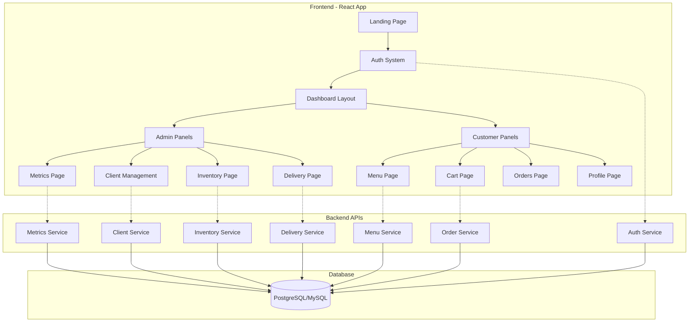

<div align="center">


# 🍽️ PortoCatering

### **Sistema de Gestión de Catering Automatizado**
*Portoviejo, Ecuador* 🇪🇨

[](https://reactjs.org/)
[](https://www.typescriptlang.org/)
[](https://tailwindcss.com/)
[](https://www.framer.com/motion/)

---

**📞 Contacto:** +593 991767957  
**🌐 Ubicación:** Portoviejo, Manabí, Ecuador

</div>

---

## 📋 **Tabla de Contenidos**

- [🎯 Descripción del Proyecto](#-descripción-del-proyecto)
- [✨ Características Principales](#-características-principales)
- [🏗️ Arquitectura del Sistema](#️-arquitectura-del-sistema)
- [🚀 Instalación y Configuración](#-instalación-y-configuración)
- [📱 Estructura del Proyecto](#-estructura-del-proyecto)
- [🔧 Tecnologías Utilizadas](#-tecnologías-utilizadas)
- [👥 Roles de Usuario](#-roles-de-usuario)
- [🎨 Diseño y UX](#-diseño-y-ux)
- [📊 Métricas y Reportes](#-métricas-y-reportes)
- [🌐 API y Backend](#-api-y-backend)
- [🔒 Seguridad](#-seguridad)
- [📸 Capturas de Pantalla](#-capturas-de-pantalla)
- [🚧 Desarrollo](#-desarrollo)
- [📄 Licencia](#-licencia)

---

## 🎯 **Descripción del Proyecto**

**PortoCatering** es una solución integral de gestión de catering desarrollada para automatizar y optimizar los procesos de negocio de servicios de catering en Portoviejo, Ecuador. El sistema está diseñado como parte de un hackathón y proporciona una plataforma completa para la gestión de pedidos, clientes, inventario y entregas.

### **🎖️ Proyecto de Hackathón**
Este sistema ha sido desarrollado como una solución innovadora para la automatización del sector de catering, enfocándose en:
- **Eficiencia Operativa** 📈
- **Experiencia del Cliente** 😊
- **Gestión Inteligente** 🧠
- **Análisis de Datos** 📊

---

## ✨ **Características Principales**

### **Para Administradores** 👨‍💼
- 📊 **Dashboard de Métricas** - Análisis en tiempo real de ventas, pedidos y satisfacción
- 👥 **Gestión de Clientes** - CRUD completo con historial de pedidos
- 📋 **Inventario Básico** - Control de stock con alertas automáticas
- 🚚 **Planificación de Entregas** - Programación y seguimiento de entregas
- 📈 **Reportes Detallados** - Análisis de tendencias y rendimiento

### **Para Clientes** 👨‍👩‍👧‍👦
- 🍽️ **Catálogo de Menús** - Navegación intuitiva por categorías
- 🛒 **Carrito de Compras** - Gestión de pedidos con cálculo automático
- 📱 **Perfil Personal** - Gestión de datos y preferencias
- 📋 **Historial de Pedidos** - Seguimiento de pedidos anteriores
- 💬 **ChatBot Inteligente** - Asistencia automatizada 24/7

### **Funcionalidades Generales** 🌟
- 🔐 **Autenticación Segura** - Login/registro con JWT
- 📱 **Diseño Responsive** - Optimizado para móviles y desktop
- 🎨 **Interfaz Moderna** - Diseño elegante con Tailwind CSS
- ⚡ **Rendimiento Optimizado** - Carga rápida y transiciones suaves
- 🌐 **Sidebar Responsive** - Navegación adaptable con animaciones

---

## 🏗️ **Arquitectura del Sistema**



---

## 🚀 **Instalación y Configuración**

### **Prerrequisitos** 📋
- Node.js (v16 o superior)
- npm o yarn
- Git

### **Paso 1: Clonar el Repositorio** 📥
```bash
git clone https://github.com/tu-usuario/catering-app.git
cd catering-app
```

### **Paso 2: Instalar Dependencias** 📦
```bash
npm install
# o
yarn install
```

### **Paso 3: Configurar Variables de Entorno** 🔧
Crear archivo `.env` en la raíz del proyecto:
```env
REACT_APP_API_URL=http://localhost:3000/api
REACT_APP_APP_NAME=PortoCatering
REACT_APP_CONTACT_PHONE=+593991767957
```

### **Paso 4: Iniciar el Servidor de Desarrollo** 🚀
```bash
npm start
# o
yarn start
```

La aplicación estará disponible en: **http://localhost:3000**

### **Paso 5: Construcción para Producción** 🏗️
```bash
npm run build
# o
yarn build
```

---

## 📱 **Estructura del Proyecto**

```
catering-app/
├── 📁 public/
│   ├── 🖼️ logo/                    # Logos de la empresa
│   ├── 📄 index.html              # HTML principal
│   └── 🎯 manifest.json           # PWA manifest
│
├── 📁 src/
│   ├── 📁 components/              # Componentes reutilizables
│   │   ├── 💬 chatbot/            # Sistema de ChatBot
│   │   ├── 👥 client/             # Gestión de clientes
│   │   ├── 🏗️ layout/             # Layouts y navegación
│   │   └── 🔒 ProtectedRoute.tsx  # Rutas protegidas
│   │
│   ├── 📁 contexts/               # Context API
│   │   ├── 🔐 AuthContext.tsx     # Estado de autenticación
│   │   └── 📱 SidebarContext.tsx  # Estado del sidebar
│   │
│   ├── 📁 pages/                  # Páginas principales
│   │   ├── 👨‍💼 admin/              # Páginas de administrador
│   │   ├── 🔐 auth/               # Login y registro
│   │   ├── 👤 customer/           # Páginas de cliente
│   │   └── 🌐 public/             # Páginas públicas
│   │
│   ├── 📁 services/               # Servicios de API
│   │   ├── 🌐 api.ts              # Configuración de Axios
│   │   ├── 🔐 auth.service.ts     # Servicio de autenticación
│   │   └── 👥 client.service.ts   # Servicio de clientes
│   │
│   ├── 📁 types/                  # Definiciones TypeScript
│   │   ├── 🔐 auth.ts             # Tipos de autenticación
│   │   ├── 👥 client.ts           # Tipos de cliente
│   │   ├── 🍽️ menu.ts             # Tipos de menú
│   │   └── 📦 order.ts            # Tipos de pedido
│   │
│   └── 📄 App.tsx                 # Componente principal
│
├── 📄 package.json                # Dependencias del proyecto
├── 📄 tailwind.config.js          # Configuración de Tailwind
├── 📄 tsconfig.json               # Configuración de TypeScript
└── 📖 README.md                   # Este archivo
```

---

## 🔧 **Tecnologías Utilizadas**

### **Frontend Core** ⚛️
| Tecnología | Versión | Propósito |
|------------|---------|-----------|
| **React** | 19.1.0 | Framework principal |
| **TypeScript** | 4.9.5 | Tipado estático |
| **React Router DOM** | 7.7.0 | Enrutamiento |

### **Estilado y UI** 🎨
| Tecnología | Versión | Propósito |
|------------|---------|-----------|
| **Tailwind CSS** | 3.x | Framework CSS |
| **Heroicons** | 2.2.0 | Iconografía |
| **Framer Motion** | 12.23.6 | Animaciones |

### **Comunicación y Datos** 🌐
| Tecnología | Versión | Propósito |
|------------|---------|-----------|
| **Axios** | 1.10.0 | Cliente HTTP |
| **Chart.js** | 4.5.0 | Gráficos |
| **React ChartJS 2** | 5.3.0 | Integración de gráficos |

### **Testing y Calidad** 🧪
| Tecnología | Versión | Propósito |
|------------|---------|-----------|
| **Jest** | 27.5.2 | Framework de testing |
| **Testing Library** | 16.3.0 | Testing de componentes |
| **ESLint** | - | Linting de código |

---

## 👥 **Roles de Usuario**

### **🔥 Administrador**
```typescript
interface AdminUser {
  role: 'admin';
  permissions: [
    'view_dashboard',
    'manage_clients',
    'manage_inventory', 
    'manage_deliveries',
    'view_metrics',
    'manage_menu'
  ];
}
```

**Funcionalidades:**
- ✅ Acceso completo al dashboard de métricas
- ✅ Gestión CRUD de clientes
- ✅ Control de inventario básico
- ✅ Planificación de entregas
- ✅ Generación de reportes
- ✅ Gestión del catálogo de menús

### **👤 Cliente**
```typescript
interface CustomerUser {
  role: 'customer';
  permissions: [
    'view_menu',
    'create_order',
    'view_own_orders',
    'manage_profile'
  ];
}
```

**Funcionalidades:**
- ✅ Navegación del catálogo de menús
- ✅ Creación y gestión de pedidos
- ✅ Visualización del historial personal
- ✅ Gestión del perfil personal
- ✅ Interacción con ChatBot

---

## 🎨 **Diseño y UX**

### **Paleta de Colores** 🎨
```css
/* Colores Principales */
--orange-400: #fb923c;   /* Naranja principal */
--orange-500: #f97316;   /* Naranja medio */
--orange-600: #ea580c;   /* Naranja oscuro */
--orange-700: #c2410c;   /* Naranja muy oscuro */

/* Gradientes */
--gradient-primary: linear-gradient(to right, #fb923c, #ea580c);
--gradient-hover: linear-gradient(to right, #f97316, #c2410c);
```

### **Principios de Diseño** 📐
- **🎯 Funcionalidad Primera** - Cada elemento tiene un propósito claro
- **📱 Mobile First** - Diseño responsive desde móvil hacia desktop
- **🎨 Consistencia Visual** - Paleta coherente en toda la aplicación
- **⚡ Microinteracciones** - Animaciones sutiles que mejoran la UX
- **♿ Accesibilidad** - Contraste adecuado y navegación por teclado

### **Componentes de UI** 🧩
- **Sidebar Responsive** - Navegación adaptable con animaciones
- **ChatBot Flotante** - Asistente con burbujas de conversación
- **Tarjetas de Métricas** - Indicadores visuales con tendencias
- **Tablas Interactivas** - Datos organizados con filtros
- **Formularios Elegantes** - Validación en tiempo real

---

## 📊 **Métricas y Reportes**

### **KPIs Principales** 📈
- 💰 **Ingresos Totales** - Seguimiento de facturación
- 📦 **Pedidos del Mes** - Volumen de órdenes
- 👥 **Clientes Activos** - Base de usuarios
- ⭐ **Satisfacción** - Rating promedio

### **Visualizaciones** 📊
- **Gráfico de Barras** - Ventas por semana
- **Barras de Progreso** - Menús más populares  
- **Tabla Dinámica** - Pedidos recientes
- **Indicadores de Tendencia** - Cambios porcentuales

### **Reportes Disponibles** 📋
- Análisis de ventas semanal/mensual
- Ranking de productos más vendidos
- Historial detallado de clientes
- Métricas de satisfacción del cliente

---

## 🌐 **API y Backend**

### **Base URL** 🔗
```
http://localhost:3000/api
```

### **Endpoints Principales** 🛣️

#### **Autenticación** 🔐
```http
POST /api/auth/login
POST /api/auth/register
GET  /api/auth/profile
```

#### **Gestión de Clientes** 👥
```http
GET    /api/clientes
GET    /api/clientes/:id
POST   /api/clientes
PATCH  /api/clientes/:id
DELETE /api/clientes/:id
GET    /api/clientes/buscar
```

#### **Catálogo de Menús** 🍽️
```http
GET  /api/menu/categorias
GET  /api/menu/items
GET  /api/menu/items/:id
POST /api/menu/items
```

#### **Métricas** 📊
```http
GET /api/metrics/dashboard
GET /api/metrics/sales-weekly
GET /api/metrics/popular-items
```

### **Autenticación** 🔒
```http
Authorization: Bearer {jwt_token}
```

---

## 🔒 **Seguridad**

### **Medidas Implementadas** 🛡️
- **JWT Tokens** - Autenticación segura
- **Rutas Protegidas** - Control de acceso por roles
- **Interceptores HTTP** - Manejo automático de tokens
- **Validación de Formularios** - Prevención de datos maliciosos
- **HTTPS Ready** - Preparado para conexiones seguras

### **Variables de Entorno** 🔐
```env
REACT_APP_API_URL          # URL del backend
REACT_APP_APP_NAME         # Nombre de la aplicación
REACT_APP_CONTACT_PHONE    # Teléfono de contacto
```

---

## 📸 **Capturas de Pantalla**

### **🏠 Landing Page**
Página de inicio elegante con presentación de servicios

### **🔐 Sistema de Autenticación**
Login y registro con validación en tiempo real

### **📊 Dashboard Administrativo**
Panel de control con métricas y KPIs

### **👥 Gestión de Clientes**
CRUD completo con búsqueda y filtros

### **🍽️ Catálogo de Menús**
Navegación intuitiva por categorías

### **💬 ChatBot Inteligente**
Asistente flotante con respuestas contextuales

---

## 🚧 **Desarrollo**

### **Scripts Disponibles** 📜
```bash
npm start          # Servidor de desarrollo
npm test           # Ejecutar tests
npm run build      # Construcción para producción
npm run eject      # Exponer configuración (irreversible)
```

### **Estructura de Commits** 📝
```
feat: nueva funcionalidad
fix: corrección de errores
docs: actualización de documentación
style: cambios de estilo
refactor: refactorización de código
test: agregado/corrección de tests
```

### **Roadmap** 🗺️
- [ ] **v1.1** - Integración de pagos en línea
- [ ] **v1.2** - Notificaciones push
- [ ] **v1.3** - App móvil nativa
- [ ] **v1.4** - Inteligencia artificial para recomendaciones
- [ ] **v1.5** - Sistema de fidelización de clientes

---

## 🤝 **Contribución**

### **Cómo Contribuir** 👨‍💻
1. Fork del repositorio
2. Crear rama para feature (`git checkout -b feature/nueva-funcionalidad`)
3. Commit de cambios (`git commit -am 'feat: nueva funcionalidad'`)
4. Push a la rama (`git push origin feature/nueva-funcionalidad`)
5. Crear Pull Request

### **Estándares de Código** 📏
- TypeScript estricto
- Componentes funcionales con hooks
- CSS con Tailwind utility classes
- Testing con Jest y Testing Library

---

## 📞 **Contacto y Soporte**

<div align="center">

### **🏢 PortoCatering**
**📍 Portoviejo, Manabí, Ecuador**

**📞 Teléfono:** +593 991767957  
**📧 Email:** contacto@portocatering.com  
**🌐 Web:** www.portocatering.com

---

### **👨‍💻 Equipo de Desarrollo**
**Proyecto de Hackathón 2024**

*Desarrollado con ❤️ para automatizar el sector de catering en Ecuador*

</div>

---

## 📄 **Licencia**

Este proyecto está bajo la Licencia MIT. Ver el archivo `LICENSE` para más detalles.

```
MIT License

Copyright (c) 2024 PortoCatering

Permission is hereby granted, free of charge, to any person obtaining a copy
of this software and associated documentation files (the "Software"), to deal
in the Software without restriction, including without limitation the rights
to use, copy, modify, merge, publish, distribute, sublicense, and/or sell
copies of the Software, and to permit persons to whom the Software is
furnished to do so, subject to the following conditions:

The above copyright notice and this permission notice shall be included in all
copies or substantial portions of the Software.
```

---

<div align="center">

### **🎉 ¡Gracias por usar PortoCatering!**

[](https://github.com/tu-usuario/catering-app/stargazers)
[](https://github.com/tu-usuario/catering-app/network)
[](https://github.com/tu-usuario/catering-app/issues)

**⭐ Si te gusta este proyecto, dale una estrella en GitHub ⭐**

</div>
